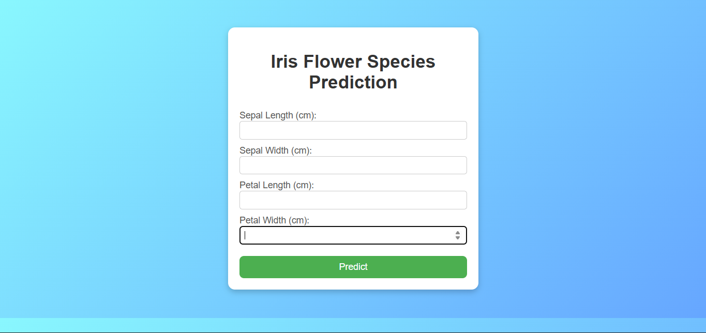
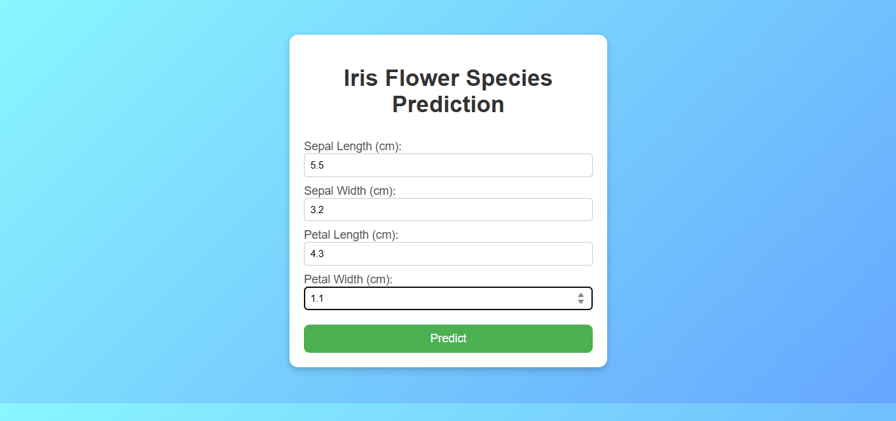
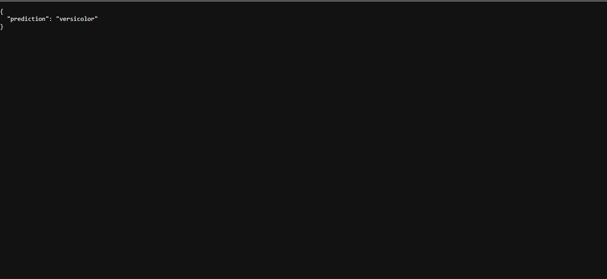

# Iris Flower Classification using SVM

## Project Overview
This project uses a **Support Vector Machine (SVM)** model to classify iris flowers into three species:
- **Setosa**
- **Versicolor**
- **Virginica**

The model is trained on the classic **Iris dataset** and deployed using **Flask**, with a simple frontend for user interaction.

---

## Dataset
The dataset used is the **Iris dataset** from `scikit-learn`, containing:
- **150 samples**
- **4 features**:
  - Sepal Length
  - Sepal Width
  - Petal Length
  - Petal Width
- **Target classes**: Setosa, Versicolor, Virginica

---

## Technologies Used
- **Python** (3.x)
- **Flask** (Web Framework)
- **scikit-learn** (Machine Learning)
- **HTML/CSS** (Frontend)
- **Pickle** (Model Serialization)

---

## How to Run the Project

### 1️. Clone the Repository
```bash
git clone https://github.com/divyapranav/Iris-Flower-Classification.git
cd Iris-Flower-Classification
```
### 2. Install Dependencies
```bash
pip install -r requirements.txt
```
### 3. Trian and Save the Model
```bash
python model.py
```
### 4. Run the Flask app
```bash
python app.py
```

---

## Project Structure
├── app.py              # Flask application
├── model.py      # Script to train and save the SVM model
├── model.pkl       # Saved SVM model
├── templates/
│   └── index.html      # Frontend HTML form
├── static/
│   └── styles.css      # CSS styling
├── requirements.txt    # Python dependencies
└── README.md           # Project documentation

---

## Features
- **Classifies iris flowers into three species based on measurements.**
- **Simple, interactive web interface.**
- **Uses Support Vector Machine for accurate classification.**
- **Deployed locally with Flask.**

---

## Screenshots

1.


2.


3.
